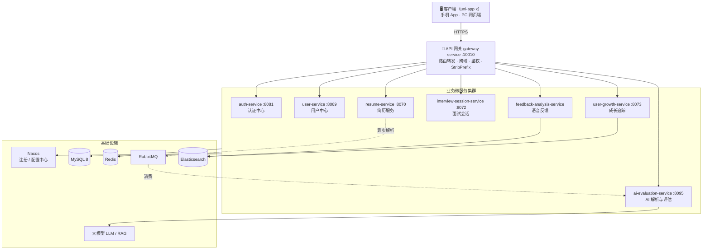

<div align="center">

# AI 面试助手 · AI Interview Assistant

**基于大模型的智能模拟面试平台**

上传简历 → AI 解析 → 定制面试 → 逐题追问 → 语音作答 → 多维评估 → 成长追踪


</div>

---

## 📖 项目简介

**AI 面试助手**是一套面向求职者的**全真模拟面试平台**。用户上传简历后，系统借助大模型完成简历结构化解析，再根据目标岗位自动生成面试题；面试过程中 AI 逐题提问并对回答实时点评，最终输出多维度的能力评估报告与个人成长曲线，帮助用户形成「**诊断 → 模拟 → 复盘 → 提升**」的闭环。

项目采用 **Spring Cloud Alibaba 微服务架构** + **uni-app x 跨端前端**，一套代码同时支持手机 App 与 PC 网页端访问。

### 解决什么问题

- 求职者不知道简历的短板在哪里 → **AI 简历解析 + 结构化诊断**
- 缺少真实面试环境、临场发挥差 → **AI 全真模拟面试，逐题追问**
- 面完不知道哪里答得不好 → **多维度评估 + 逐题点评 + 改进建议**
- 长期练习看不到进步 → **技能成长曲线 + 阶段性成长报告**

---

## ✨ 核心功能

| 模块 | 能力 |
|---|---|
| 🔐 **用户认证** | 注册 / 登录 / Token 刷新 / 登出，JWT + 网关统一鉴权 |
| 📄 **简历管理** | 上传简历（PDF/Word）、AI 结构化解析、技能/经历/项目/教育子表管理 |
| ⚙️ **面试配置** | 自定义面试官风格、难度、目标技能、题型分类、语言（中/英） |
| 🎙️ **模拟面试** | AI 逐题提问、即时点评、语音作答、实时对话流程 |
| 📊 **AI 评估** | 技术 / 表达 / 清晰度 / 深度 / 解题 五维评分，逐题反馈与改进建议 |
| 🔊 **语音反馈** | 语速、流利度、清晰度、填充词统计等语音特征分析 |
| 📈 **成长追踪** | 技能评分、历史趋势曲线、成长报告、薄弱点提升建议 |

> 前端内置 **Mock 演示模式**：无需启动后端即可完整体验全部交互流程（见下方 [前端说明](#-前端说明)）。

---

## 🏗️ 系统架构



**关键链路**

- **简历解析（异步）**：前端上传简历 → `resume-service` 存库并投递 MQ → `ai-evaluation-service` 消费消息，调用大模型解析出结构化数据 → 回写简历服务。
- **面试评估**：完成一次面试会话后，答题记录进入 `ai-evaluation-service` 生成多维度评估，再由 `user-growth-service` 沉淀为技能评分与成长报告。

---

## 🧩 微服务模块

| 服务 | 端口 | 网关前缀 | 职责 |
|---|:---:|:---:|---|
| `gateway-service` | 10010 | — | 统一入口：路由转发、跨域、`StripPrefix=1` |
| `auth-service` | 8081 | `/as` | 注册、登录、Token 签发与刷新、登出 |
| `user-service` | 8069 | `/us` | 用户资料、求职画像 |
| `resume-service` | 8070 | `/res` | 简历上传、解析结果管理、子表 CRUD |
| `interview-session-service` | 8072 | `/is` | 面试配置、面试会话、问答记录 |
| `ai-evaluation-service` | 8095 | `/ae` | 简历解析（MQ 消费）、答案与会话评估、报告生成 |
| `feedback-analysis-service` | — | `/fa` | 语音分析与统计 *（建设中）* |
| `user-growth-service` | 8073 | `/ug` | 技能评分、成长趋势、报告、薄弱点 |
| `common-service` | — | — | 公共模块：统一返回、异常处理、拦截器、常量、工具 |
| `api` | — | — | 服务间调用 Feign 客户端定义 |

---

## 🛠️ 技术栈

**后端**

| 类别 | 技术 |
|---|---|
| 框架 | Spring Boot 3.3.5、Spring Cloud 2023.0.3、Spring Cloud Alibaba 2023.0.3.2 |
| AI | Spring AI 1.0.0（大模型接入、Prompt 编排、RAG 检索增强） |
| 服务治理 | Nacos（注册 + 配置中心）、Spring Cloud Gateway、OpenFeign、LoadBalancer |
| 持久层 | MyBatis-Plus 3.5.9、MySQL 8.0 |
| 缓存 | Redis（Redisson） |
| 消息队列 | RabbitMQ（简历解析、评估异步解耦） |
| 搜索 | Elasticsearch 7.12.1 |
| 接口文档 | Knife4j / OpenAPI 3 |
| 对象存储 | 阿里云 OSS |
| 鉴权 | JWT + 网关统一校验 + 用户上下文透传 |

**前端**

| 类别 | 技术 |
|---|---|
| 框架 | uni-app x（uvue + uts）、Vue 3 组合式 API |
| 多端 | 一套代码 → 手机 App（Android/iOS）+ H5 桌面端 |
| 状态/请求 | 统一 request 封装 + 接口层 `USE_MOCK` 开关 |
| UI | 自研设计系统（玻璃拟态卡片、渐变主题、骨架屏、入场动效） |

---

## 🖥️ 前端说明

前端位于独立目录（`HBuilderProjects/interview`），核心结构：

```
interview/
├── api/                 # 接口层（user / resume / interview / evaluation / feedback / growth）
├── mock/index.js        # 演示数据层 + USE_MOCK 全局开关
├── components/          # 通用组件（PageLayout / GlassCard / ScoreRing / 骨架屏…）
├── pages/
│   ├── login · register · index · user
│   ├── resume/          # 简历列表 / 详情
│   ├── interview/       # 配置列表 / 编辑 / 创建会话 / 面试房间 / 面试记录
│   ├── evaluation/      # 评估结果 / 答题详情
│   ├── feedback/        # 语音分析 / 语音统计
│   └── growth/          # 技能评分 / 趋势 / 报告 / 薄弱点
└── manifest.json · pages.json · uni.scss
```

### Mock 演示模式

所有接口通过 `mock/index.js` 的 `USE_MOCK` 开关控制：

- `USE_MOCK = true`：返回本地假数据（带模拟延迟），**不启动后端即可完整演示**
- `USE_MOCK = false`：请求真实网关 `http://localhost:10010`

后端每完成一个接口，把对应 `api/*.js` 的开关关掉即可无缝切换，页面无需改动。

---

## 🚀 快速开始

### 环境要求

| 组件 | 版本 |
|---|---|
| JDK | 17+ |
| Maven | 3.9+ |
| MySQL | 8.0 |
| Redis | 6+ |
| RabbitMQ | 3.x |
| Elasticsearch | 7.12.x |
| Nacos | 2.x |

### 启动后端

1. **准备基础设施**：启动 MySQL、Redis、RabbitMQ、Elasticsearch、Nacos。
2. **初始化数据库**：为各服务创建库（`user_db`、`resume_db`、`session_db`、`evaluation_db`、`growth_db`、`feedback_db` 等）并导入建表脚本。
3. **配置 Nacos**
   - 在 Nacos 中创建命名空间与共享配置：`shared-spring.yaml`、`shared-redis.yaml`、`shared-logs.yaml`
   - 各服务通过 `spring.config.import` 导入自身配置与共享配置
   - 数据库连接等敏感信息统一放在 **Nacos 配置中心**或**本地私有配置**，不要提交到仓库
4. **编译**
   ```bash
   mvn clean install -DskipTests
   ```
5. **启动顺序**：`gateway-service` 依赖各服务注册，建议先启动基础设施 → 各业务服务 → 网关。

### 启动前端

1. 用 **HBuilderX** 打开前端目录。
2. 演示模式：保持 `mock/index.js` 中 `USE_MOCK = true`，直接「运行到浏览器 / 运行到手机模拟器」。
3. 联调后端：将 `USE_MOCK` 置为 `false`，并在请求配置中指向网关地址 `http://<host>:10010`。

---

## 🔌 接口约定

网关统一入口 `http://<host>:10010`，配置 `StripPrefix=1`，即路径第一段为服务前缀。

| 前缀 | 目标服务 |
|:---:|---|
| `/as` | auth-service |
| `/us` | user-service |
| `/res` | resume-service |
| `/is` | interview-session-service |
| `/ae` | ai-evaluation-service |
| `/fa` | feedback-analysis-service |
| `/ug` | user-growth-service |

**示例**

```
POST /as/auth/login                       → auth-service  POST /auth/login
GET  /res/resumes                         → resume-service GET /resumes
POST /is/interviews/sessions              → interview-session-service POST /interviews/sessions
GET  /ae/evaluations/{sessionId}          → ai-evaluation-service GET /evaluations/{sessionId}
GET  /ug/growth/skills                    → user-growth-service GET /growth/skills
```

鉴权请求需在 Header 携带 `Authorization: Bearer <token>`，网关校验通过后向下游透传用户身份。

---

## 📁 后端目录结构

```
interview/
├── gateway-service/            # 网关：路由、跨域、鉴权
├── auth-service/               # 认证中心
├── user-service/               # 用户服务
├── resume-service/             # 简历服务
├── interview-session-service/  # 面试会话服务
├── ai-evaluation-service/      # AI 解析与评估服务
├── feedback-analysis-service/  # 语音反馈服务
├── user-growth-service/        # 成长追踪服务
├── common-service/             # 公共模块（返回体、异常、拦截器、常量、工具）
├── api/                        # Feign 客户端定义
└── pom.xml                     # 聚合父 POM
```

---

## 🗺️ Roadmap

- [x] 用户认证、简历管理、面试会话、AI 评估、成长追踪
- [x] 前端全端适配（手机 App + PC 网页端）与 Mock 演示模式
- [ ] 实时语音面试（WebSocket / STOMP 长连接）
- [ ] 语音特征分析（语速、流利度、填充词）
- [ ] Elasticsearch 全文检索与岗位推荐
- [ ] 面试报告自动生成与消息推送

---

## 👤 作者

- **Author**：1xmxl

> 本项目为个人作品集项目，用于学习与实践微服务架构、大模型应用与跨端开发。
